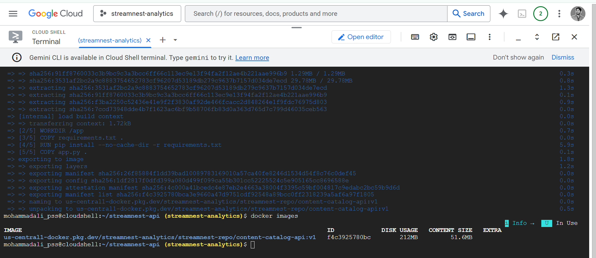
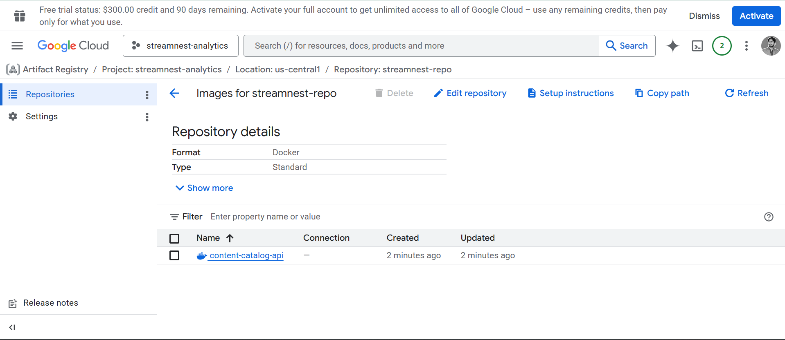
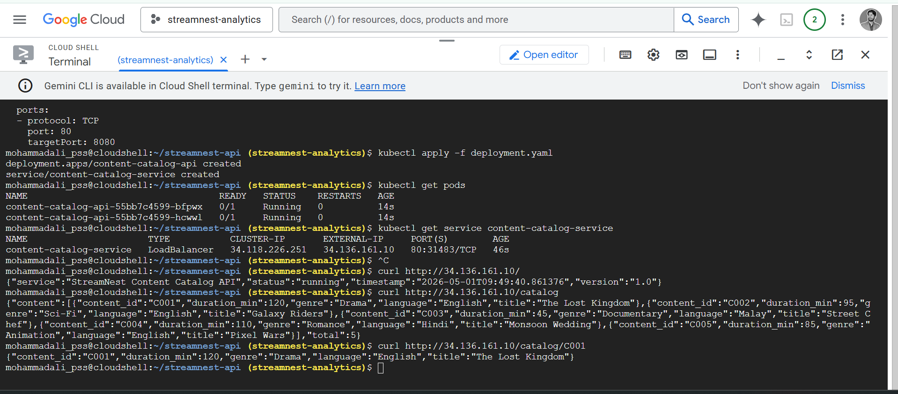
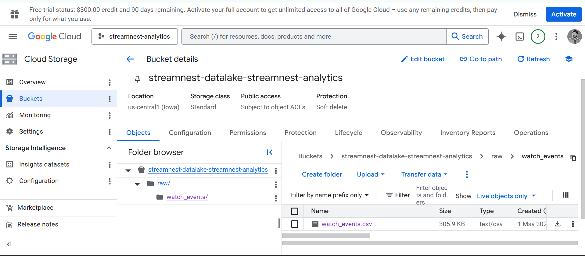
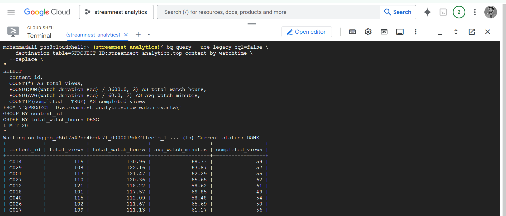
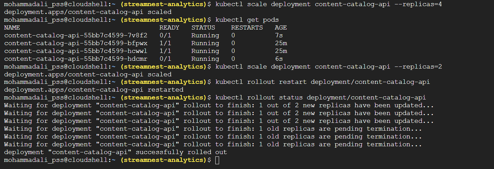

# Cloud Infrastructure for StreamNest Analytics

---

## Overview

This repository contains the proof-of-concept implementation for StreamNest, a video streaming platform with 2 million active users across Southeast Asia. The project migrates StreamNest's infrastructure to Google Cloud Platform (GCP) by solving two core problems:

- Inconsistent, manual microservice deployments on bare virtual machines
- No unified data platform for analytics and business reporting

The solution is split into two parts: containerized microservice deployment on GKE, and a data lakehouse pipeline using GCS and BigQuery.

---

## Architecture

```
Part A: Containerization
────────────────────────
Flask API (app.py)
  → Docker Build
  → Artifact Registry (streamnest-repo)
  → GKE Cluster (streamnest-cluster, us-central1-a)
  → Kubernetes Deployment (2 replicas)
  → LoadBalancer Service (Public IP: 34.136.161.10)

Part B: Data Lakehouse
──────────────────────
Python Data Generator (generate_data.py)
  → watch_events.csv (5,000 rows)
  → Google Cloud Storage (raw/watch_events/)
  → BigQuery External Table (raw_watch_events)
  → Aggregated Tables:
       top_content_by_watchtime
       device_usage_by_region
       daily_viewing_trends
```

---

## GCP Services Used

| Service | Purpose |
|---|---|
| Artifact Registry | Private Docker image storage |
| Google Kubernetes Engine (GKE) | Managed container orchestration |
| Google Cloud Storage (GCS) | Raw data ingestion layer |
| BigQuery | Serverless analytics engine |

---

## Repository Structure

```
├── app.py                        # Flask Content Catalog API
├── requirements.txt              # Python dependencies
├── Dockerfile                    # Container build instructions
├── deployment.yaml               # Kubernetes Deployment + Service manifest
├── generate_data.py              # Watch event dataset generator
├── table_def.json                # BigQuery external table definition
├── report/
│   └── streamnest_design_document.pdf   # Full design document
└── screenshots/
    ├── 1.png   - app.py created in Cloud Shell
    ├── 2.png   - requirements.txt and Dockerfile verified
    ├── 3.png   - Docker build success
    ├── 4.png   - Artifact Registry repository
    ├── 5.png   - Docker image in Artifact Registry
    ├── 6.png   - GKE Workloads page
    ├── 7.png   - Pods running + external IP + curl responses
    ├── 8.png   - Cloud Storage bucket with watch_events.csv
    ├── 9.png   - BigQuery: top_content_by_watchtime results
    ├── 10.png  - BigQuery: device_usage_by_region results
    ├── 11.png  - BigQuery: daily_viewing_trends results
    ├── 12.png  - bq ls showing all four tables
    └── 13.png  - Scaling to 4 pods + rolling update success
```

---

## Part A: Containerization and GKE Deployment

### Step 1 — Project Files

**app.py** — Content Catalog API with four endpoints:
- `GET /` — Service metadata
- `GET /catalog` — List all content (supports `?genre=` filter)
- `GET /catalog/<id>` — Single content lookup
- `GET /health` — Kubernetes liveness/readiness probe

**requirements.txt**
```
Flask==3.0.0
gunicorn==21.2.0
```

**Dockerfile**
```dockerfile
FROM python:3.11-slim
WORKDIR /app
COPY requirements.txt .
RUN pip install --no-cache-dir -r requirements.txt
COPY app.py .
EXPOSE 8080
CMD ["gunicorn", "--bind", "0.0.0.0:8080", "--workers", "2", "app:app"]
```

### Step 2 — Set Environment Variables

```bash
export PROJECT_ID=$(gcloud config get-value project)
export REGION=us-central1
```

### Step 3 — Create Artifact Registry Repository

```bash
gcloud artifacts repositories create streamnest-repo \
  --repository-format=docker \
  --location=$REGION \
  --description="StreamNest microservices repository"
```

### Step 4 — Build and Push Docker Image

```bash
gcloud auth configure-docker $REGION-docker.pkg.dev

docker build -t $REGION-docker.pkg.dev/$PROJECT_ID/streamnest-repo/content-catalog-api:v1 .

docker push $REGION-docker.pkg.dev/$PROJECT_ID/streamnest-repo/content-catalog-api:v1
```

### Step 5 — Create GKE Cluster

```bash
gcloud container clusters create streamnest-cluster \
  --zone=us-central1-a \
  --num-nodes=2 \
  --machine-type=e2-medium \
  --disk-size=20GB
```

### Step 6 — Connect kubectl to Cluster

```bash
gcloud container clusters get-credentials streamnest-cluster \
  --zone=us-central1-a

kubectl get nodes
```

### Step 7 — Deploy to Kubernetes

The `deployment.yaml` file defines a Deployment with 2 replicas, liveness/readiness probes, and a LoadBalancer Service on port 80.

```bash
kubectl apply -f deployment.yaml

kubectl get pods
kubectl get service content-catalog-service
```

### Step 8 — Test the Live API

```bash
curl http://34.136.161.10/
curl http://34.136.161.10/catalog
curl http://34.136.161.10/catalog/C001
curl http://34.136.161.10/catalog?genre=Drama
```

### Step 9 — Scale and Rolling Update

```bash
# Scale up
kubectl scale deployment content-catalog-api --replicas=4
kubectl get pods

# Scale back down
kubectl scale deployment content-catalog-api --replicas=2

# Zero-downtime rolling update
kubectl rollout restart deployment/content-catalog-api
kubectl rollout status deployment/content-catalog-api
```

---

## Part B: Data Lakehouse Pipeline

### Step 1 — Generate Dataset

```bash
python3 generate_data.py
# Output: watch_events.csv (5,000 rows)
```

### Step 2 — Create Cloud Storage Bucket

```bash
export BUCKET_NAME="streamnest-datalake-$PROJECT_ID"

gsutil mb -l $REGION gs://$BUCKET_NAME

gsutil cp watch_events.csv gs://$BUCKET_NAME/raw/watch_events/watch_events.csv
```

### Step 3 — Create BigQuery Dataset

```bash
bq mk \
  --dataset \
  --location=$REGION \
  --description="StreamNest analytics dataset" \
  $PROJECT_ID:streamnest_analytics
```

### Step 4 — Create External Table

```bash
bq mk \
  --table \
  --external_table_definition=table_def.json \
  $PROJECT_ID:streamnest_analytics.raw_watch_events
```

**table_def.json** points the external table to the GCS file with the full 8-column schema (event_id, user_id, content_id, watch_duration_sec, device_type, region, timestamp, completed).

### Step 5 — Run Analytics Queries

**Top content by watch time:**
```sql
SELECT
  content_id,
  COUNT(*) AS total_views,
  ROUND(SUM(watch_duration_sec) / 3600.0, 2) AS total_watch_hours,
  ROUND(AVG(watch_duration_sec) / 60.0, 2) AS avg_watch_minutes,
  COUNTIF(completed = TRUE) AS completed_views
FROM `PROJECT_ID.streamnest_analytics.raw_watch_events`
GROUP BY content_id
ORDER BY total_watch_hours DESC
LIMIT 20
```

**Device usage by region:**
```sql
SELECT
  region,
  device_type,
  COUNT(*) AS total_events,
  ROUND(SUM(watch_duration_sec) / 3600.0, 2) AS total_watch_hours
FROM `PROJECT_ID.streamnest_analytics.raw_watch_events`
GROUP BY region, device_type
ORDER BY region, total_events DESC
```

**Daily viewing trends:**
```sql
SELECT
  DATE(timestamp) AS watch_date,
  COUNT(*) AS total_events,
  COUNT(DISTINCT user_id) AS unique_viewers,
  ROUND(SUM(watch_duration_sec) / 3600.0, 2) AS total_watch_hours
FROM `PROJECT_ID.streamnest_analytics.raw_watch_events`
GROUP BY watch_date
ORDER BY watch_date
```

### Step 6 — Verify All Tables

```bash
bq ls streamnest_analytics
```

Expected output:
```
tableId                    Type
daily_viewing_trends       TABLE
device_usage_by_region     TABLE
raw_watch_events           EXTERNAL
top_content_by_watchtime   TABLE
```

---

## Screenshots

| Screenshot | Description |
|---|---|
|  | Docker build success and image created |
|  | Docker image in Artifact Registry |
|  | Pods running with public IP and live API response |
|  | Cloud Storage bucket with raw dataset |
|  | BigQuery top content by watch time |
|  | Scaling to 4 pods and rolling update success |

---

## Key Results

| Metric | Value |
|---|---|
| Public API endpoint | http://34.136.161.10 |
| GKE cluster | streamnest-cluster, us-central1-a |
| Watch events ingested | 5,000 rows |
| Top content (watch hours) | C014 with 130.96 hours |
| Top device in Indonesia | Mobile (186 events) |
| Top device in Malaysia | Tablet (189 events) |

---

## Cleanup

To avoid charges after the assignment:

```bash
gcloud container clusters delete streamnest-cluster --zone=us-central1-a

gsutil rm -r gs://$BUCKET_NAME

bq rm -r -d $PROJECT_ID:streamnest_analytics
```

---

## Tech Stack


